# Pulse — Competition Submission

**Scripture that meets you where you are.**

**Competition:** Scripture in New Frontiers (Kaggle / YouVersion / Life.Church + Gloo)
**Track:** Wearables
**Submission date:** 2026-07-31

---

## Problem Statement

Apple Watch tracks your heartbeat, your sleep, your breath, your steps — an extraordinarily intimate portrait of your physical and emotional state. Yet that data has never been used to deliver scripture. Devotional apps operate on fixed schedules: a verse at 7 AM regardless of whether you just finished a marathon, slept terribly, or are awake at 2 AM with your thoughts. Health apps show you numbers but offer no pastoral response to those numbers.

The gap is real. A person whose HRV has crashed after a week of poor sleep does not need the same verse as someone whose watch just detected a post-workout recovery surge. A believer waking in the night with irregular rhythms needs something quieter than a morning devotional. Scripture has exactly the right words for every moment of the human body's experience — but no app has ever known which moment you are actually in.

---

## Solution Description

Pulse closes that gap. It is a native iOS + watchOS app that runs a continuous biometric-to-scripture pipeline:

**Step 1 — HealthKit Observation.** The app passively monitors Apple Watch sensors in the background: heart rate, heart rate variability (HRV), blood oxygen (SpO2), sleep analysis (efficiency, deep sleep, REM, total duration), active energy, step count, and respiratory rate.

**Step 2 — State Classification.** A weighted scoring algorithm (`StateClassifier.swift`) converts the most recent health snapshot into one of 12 named biometric states. Each state has a name, a scripture theme, and a delivery urgency level:

| State | Display Name | Scripture Theme |
|---|---|---|
| `energized_post_workout` | Victory Lap | Strength, perseverance, finishing the race |
| `stressed_anxious` | Still Waters | Peace, "do not fear," rest in God |
| `exhausted_depleted` | Weary Soul | Renewal, "come to me all who are weary" |
| `deep_rest_recovered` | Sabbath Morning | Praise, gratitude, new mercies |
| `peaceful_steady` | Still Small Voice | Abiding, dwelling, God's presence |
| `morning_awakening` | New Mercies | Morning devotional, Lamentations 3:22-23 |
| `evening_winding_down` | Evening Psalm | Rest, Psalm 91, trust |
| `active_engaged` | Purpose Walk | Calling, purpose, walking in Spirit |
| `sad_withdrawn` | Broken Vessel | Hope, Psalm 34, God near the brokenhearted |
| `sick_unwell` | Healing Hands | Healing, Psalm 103, God as healer |
| `peak_performance` | Mountain Top | Excellence, calling, Philippians 4:13 |
| `spiritual_alert` | Watchman Hour | Prayer, Isaiah 40, the midnight watch |

**Step 3 — Gloo AI Studio call.** The classified state (an enum value, never raw health numbers) is sent to Gloo AI Studio, which selects the most contextually relevant Bible verse reference for that state. See the Gloo AI Studio Usage section for the exact request/response contract.

**Step 4 — YouVersion Platform API fetch.** The verse reference returned by Gloo is used to fetch the full verse text from YouVersion in the user's preferred Bible translation. See the YouVersion API Usage section for the exact endpoints.

**Step 5 — Smart Delivery.** The verse is pushed to:
- The Apple Watch face complication (always-on, glanceable)
- The watch's VerseView (full text with Love, Save, Share actions)
- An iPhone notification (foreground banner or background alert)
- The iPhone HomeView (state banner + verse card + metrics grid)

A delivery cooldown (4-hour minimum) and quiet-hours window prevent the app from becoming intrusive.

**Step 6 — History and Engagement.** Every delivered verse is stored locally in SwiftData with its biometric context, timestamp, and state. The History view shows a date-sectioned journey. Users can save favorites, share verse cards as images, and react from the watch.

**Fallback chain.** If Gloo AI Studio is unavailable, the app falls back to a local reference map keyed on the biometric state. If YouVersion is unavailable, the app serves a cached verse from a previous successful delivery. If neither is available, a set of 12 hand-selected emergency verses (one per state, bundled in `emergency_verses.json`) is served. The user always receives a verse.

---

## YouVersion API Usage

Pulse calls two YouVersion Platform API endpoints.

**Authentication.** All requests include the static App Key in the `X-YVP-App-Key` header. No token exchange is required.

### Endpoint 1 — Bible passage fetch

```
GET https://api.youversion.com/v1/bibles/{bibleId}/passages/{usfmReference}?format=text
```

Used to retrieve the text of the verse selected by Gloo AI. Called by `YouVersionClient.swift` every time a new verse is delivered.

Example (Matthew 11:28, BSB translation, ID 3034):
```
GET https://api.youversion.com/v1/bibles/3034/passages/MAT.11.28?format=text
X-YVP-App-Key: <app_key>
```

Response:
```json
{
  "id": "MAT.11.28",
  "reference": "Matthew 11:28",
  "content": "Come to Me, all you who are weary and burdened, and I will give you rest."
}
```

The USFM reference format (`BOOK.CHAPTER.VERSE`) is constructed from the verse reference string returned by Gloo AI. Multi-verse ranges use the short form `BOOK.C.VS-VE` for same-chapter ranges (e.g., `MAT.11.28-30`) and full dot notation for cross-chapter ranges (e.g., `GEN.1.1-2.3`). The `?format=text` parameter returns plain text rather than HTML with `<span data-usfm="...">` wrappers.

**Live verification (2026-07-31):** `GET /v1/bibles/3034/passages/MAT.11.28?format=text` with a real App Key returned the passage text above. The response does not include a `copyright` field; copyright attribution is derived from the Bible version metadata.

### Endpoint 2 — Available translations list

```
GET https://api.youversion.com/v1/bibles?language_ranges[]=eng
```

Called once at app launch (and again when the user opens Settings) to populate the translation picker with the translations actually granted to this App Key. The `language_ranges[]=eng` parameter is required; omitting it returns HTTP 422. Without `all_available=true`, the response contains only the translations your App Key is authorized to serve.

**Live verification (2026-07-31):** The registered App Key grants 11 translations: ASV (12), CPDV (42), Geneva (2163), TOJB2011 (130), WEB US (206), LSV (2660), BSB (3034), WMBBE (1207), WMB (1209), TCENT (3427), FBV (1932). Commercial translations (NIV 111, ESV 59, KJV 1) return `{"message":"Access denied for <id>"}`. The default translation is BSB (Berean Standard Bible, ID 3034).

**Bible version IDs used:** BSB = 3034 (default). All others are presented dynamically from the granted set.

---

## Gloo AI Studio Usage

Pulse uses the Gloo AI Platform's chat completions API to select the most pastorally appropriate Bible verse for a user's current biometric state.

### Authentication

OAuth2 Client Credentials flow. At app startup (and whenever the cached token expires), `GlooAIClient.swift` exchanges the Client ID and Client Secret for a Bearer token:

```
POST https://platform.ai.gloo.com/oauth2/token
Authorization: Basic base64(CLIENT_ID:CLIENT_SECRET)
Content-Type: application/x-www-form-urlencoded

grant_type=client_credentials&scope=api/access
```

Response:
```json
{
  "access_token": "eyJ...",
  "token_type": "Bearer",
  "expires_in": 3600
}
```

The token is cached and reused until 60 seconds before its expiry time to avoid unnecessary round-trips. The Client ID and Client Secret are stored in the gitignored `Config/Debug.xcconfig` (never committed); they are injected at build time via xcconfig and read from `Info.plist` at runtime.

### Chat Completions Endpoint

```
POST https://platform.ai.gloo.com/ai/v2/chat/completions
Authorization: Bearer <access_token>
Content-Type: application/json
```

**Model:** `gloo-anthropic-claude-sonnet-4.6`

### The Pastoral System Prompt

The system prompt is defined in `GlooAIClient.swift` (lines 133–152) and is sent with every verse selection request:

```
You are a pastoral scripture guide for a health and wellness app called Pulse.
Your role is to select a single Bible verse (or short passage of 2–3 verses) that is
most relevant and meaningful to a person currently experiencing the described physical
and emotional state.

Guidelines:
- Select verses that DIRECTLY address the stated condition
- Prefer well-known, beloved verses that resonate emotionally
- Never select verses that could feel judgmental or shame-inducing
- For physical states (post-workout, sick), select verses that honor the body as God's temple
- For emotional states (stressed, sad), select verses that offer genuine comfort
- Vary selections over time — do not repeat verses frequently
- Consider the time of day (morning verses are energizing; evening verses are peaceful)
- The translation is a preference — always select the reference, not translation-specific text

Return JSON only. No explanation outside the JSON structure. Return ONLY a JSON object
with exactly these keys: verse_reference (string), theme (string, snake_case),
theme_display_name (string), rationale (string), alternates (array of strings).
```

Because the Gloo V2 API does not support a `response_format` / JSON mode parameter, the system prompt instructs the model to return JSON only. The client parses defensively: it strips any markdown code fences, locates the first `{` and last `}`, and decodes the contained JSON.

### Request Body (JSON contract)

The user message contains only state enum values and preferences. **No raw health numbers are ever included.**

```json
{
  "messages": [
    {
      "role": "system",
      "content": "<pastoral system prompt above>"
    },
    {
      "role": "user",
      "content": "{\"state\":\"exhausted_depleted\",\"state_display_name\":\"Weary Soul\",\"time_of_day\":\"evening\",\"confidence\":0.82,\"recent_states\":[\"stressed_anxious\",\"exhausted_depleted\"],\"translation_abbreviation\":\"BSB\",\"preferred_themes\":[],\"avoid_repeats\":[]}"
    }
  ],
  "model": "gloo-anthropic-claude-sonnet-4.6",
  "tradition": "evangelical",
  "max_tokens": 512
}
```

The user message is a JSON-encoded `GlooUserMessage` struct with exactly these fields:

| Field | Type | Description |
|---|---|---|
| `state` | string | `BiometricState.rawValue` — snake_case enum identifier |
| `state_display_name` | string | Human name (e.g., "Weary Soul") |
| `time_of_day` | string | `morning` / `afternoon` / `evening` / `night` |
| `confidence` | number | Classification confidence 0.0–1.0 |
| `recent_states` | string[] | Raw values of the last 3–5 states (for variety) |
| `translation_abbreviation` | string | User's preferred translation (e.g., "BSB") |
| `preferred_themes` | string[] | User's saved theme preferences |
| `avoid_repeats` | string[] | Recently delivered verse references to avoid |

**Privacy guarantee:** The `HealthSnapshot` that produced the classification (containing HR bpm, HRV ms, SpO2 %, sleep minutes, step count, respiratory rate) is consumed entirely on-device by the `StateClassifier`. None of those numeric values enter the API call. The API call contains only the resulting enum label and user preferences, as confirmed by the `VerseSelectionContext` struct definition in `ScriptureProtocols.swift`:

```swift
// No raw health numbers (heart rate, HRV, bpm, etc.) are included.
public struct VerseSelectionContext: Sendable {
    public let state: BiometricState
    public let timeOfDay: TimeOfDay
    public let confidence: Double
    public let recentStates: [BiometricState]
    public let translationAbbreviation: String
    public let preferredThemes: [String]
    public let avoidRepeats: [String]
}
```

### Model Response

```json
{
  "choices": [{
    "message": {
      "content": "{\"verse_reference\":\"Matthew 11:28\",\"theme\":\"renewal\",\"theme_display_name\":\"Rest and Renewal\",\"rationale\":\"Jesus directly addresses the weary and burdened, offering rest — the most precise pastoral match for exhaustion and depletion.\",\"alternates\":[\"Isaiah 40:31\",\"Psalm 62:1-2\"]}"
    }
  }]
}
```

The `verse_reference` from this response is passed directly to the YouVersion API passage endpoint.

**Live API verification (2026-07-31, real credentials):**
- `exhausted_depleted` → Matthew 11:28 (NIV)
- `stressed_anxious` → Psalm 94:19
- `energized_post_workout` → Isaiah 40:31
- `energized_post_workout` (second delivery, avoid-repeats active) → 1 Corinthians 6:19-20

The `tradition` parameter is sent as `evangelical`; this is Gloo's faith-community routing hint for content selection.

---

## Technical Architecture Overview

Pulse is implemented as three XcodeGen-generated targets and one local Swift Package, all sharing the same codebase with no third-party dependencies (excluding Apple system frameworks).

### Targets

**Pulse** (iOS 17.0+, iPhone)
- Entry point: `PulseApp.swift` — wires the health engine, scripture engine, SwiftData container, WatchConnectivity, and background task scheduler at launch.
- `HealthEngine` — `HKObserverQuery` + `HKSampleQuery` for 7 metric types; `BGProcessingTask` handler for background refresh; `enableBackgroundDelivery()` for HealthKit push notifications.
- `ScriptureEngine` — orchestrates the `VerseSelecting` → `VerseFetching` → `VerseCache` → delivery pipeline. Fallback chain: Gloo → local reference map → SwiftData cache → bundled `emergency_verses.json`.
- `PhoneSessionManager` — WatchConnectivity phone side; relays `VerseDelivery` objects to the watch via `WCSession.transferUserInfo()` (guaranteed delivery).
- SwiftData persistence in an App Group container (`group.com.joelroy.pulse`) shared with the watch: `VerseDelivery`, `CachedVerse`, `UserPreferences`.
- Features: Onboarding (4 steps), HomeView, HistoryView, ShareCardView + `ImageRenderer`-based export, SettingsView.

**PulseWatch** (watchOS 10.0+, Apple Watch)
- Vertical-page TabView: VerseView (full text + Love/Save/Share), VitalsView (live metrics), HistoryView (recent deliveries), PrayerView (4 prayer state buttons).
- `WatchSessionManager` — WatchConnectivity watch side; receives verse payloads, updates AppStorage, triggers complication reload via `WidgetCenter.shared.reloadAllTimelines()`.
- Haptics on verse delivery.

**PulseWatchWidgets** (WidgetKit complication extension)
- `PulseComplications.swift` — declares 4 supported accessory families: `accessoryCircular`, `accessoryRectangular`, `accessoryInline`, `accessoryCorner`.
- `ComplicationViews.swift` — renders current verse text and biometric state for each family.
- Timeline entry reads from App Group AppStorage key `PulseEntry.currentVerse`.

**PulseShared** (local Swift Package — `PulseShared/`)
- `Models/` — `BiometricState` (12 states + display metadata + gradient definitions), `HealthSnapshot`, `ClassificationResult`, `BibleVerse`, `WatchMessage` payload types, `BibleTranslationID`.
- `Logic/` — `StateClassifier` (weighted sub-score algorithm → composite score → state band), `SleepAnalyzer`, `DeliveryRulesEngine`, `FallbackVerseProvider`.
- `Scripture/` — `GlooAIClient` (OAuth2 + chat completions), `YouVersionClient` (App Key + passage fetch), `ScriptureProtocols` (type-erased `VerseSelecting` / `VerseFetching` interfaces).
- `Design/` — color tokens (dark-mode palette per state), typography scale, spacing constants, animation curves.

### Data Flow

```
HealthKit sensors
    → HealthEngine (background + foreground observer queries)
    → MetricCollector (7 metric types → HealthSnapshot)
    → StateClassifier (sub-scores → composite → BiometricState)
    → DeliveryScheduler (cooldown + quiet hours check)
    → ScriptureEngine.deliverFirstVerse()
        → GlooAIClient.selectVerse(VerseSelectionContext)
              → POST /ai/v2/chat/completions → verse_reference
        → YouVersionClient.fetchVerse(reference, bibleID)
              → GET /v1/bibles/{id}/passages/{usfm}?format=text → verse text
        → VerseCache.store(VerseDelivery) [SwiftData]
        → PhoneSessionManager.sendVerse() → WCSession
              → WatchSessionManager receives → AppStorage update
              → WidgetCenter.reloadAllTimelines() → complication update
    → HomeView update (via @Environment(ScriptureEngine))
    → Notification (UNUserNotificationCenter)
```

**Key design decisions:**
- WidgetKit complications replace the deprecated ClockKit API.
- `@Observable` view models throughout (Swift 5.9 Observation framework, not `ObservableObject`/Combine).
- All network calls use Swift Concurrency (`async/await`) with 15-second timeouts.
- No force-unwraps in any production code path.
- No third-party dependencies — only Apple system frameworks.
- Project structure is managed by XcodeGen (`project.yml`); `Pulse.xcodeproj` is regenerated and not committed.

---

## Privacy Approach

Privacy is not a feature add-on in Pulse; it is an architectural constraint enforced at the API boundary.

**On-device health data.** All HealthKit data (heart rate, HRV, SpO2, sleep breakdown, step count, respiratory rate) is read and processed entirely on the user's iPhone. The `StateClassifier` converts raw numbers into a categorical state label on-device. The numeric values are never serialized or transmitted anywhere.

**What leaves the device.** The Gloo AI Studio API call contains only:
- A `BiometricState` enum label (e.g., `"exhausted_depleted"`)
- A `TimeOfDay` enum label (e.g., `"evening"`)
- A classification confidence score (0.0–1.0)
- An array of recent `BiometricState` labels (for variety)
- The user's preferred translation abbreviation
- Optional theme preferences and avoid-repeat verse references

No name, no age, no precise HR value, no HRV reading, no GPS location, no device identifier, and no persistent user ID is included in any API request.

**No analytics or crash-reporting SDKs.** The project has zero third-party SDK dependencies. A grep across all Swift sources for known analytics frameworks (Firebase, Amplitude, Mixpanel, Segment, Crashlytics, Datadog, Sentry) returns no matches.

**Local persistence only.** Verse history, preferences, and cached verse text are stored in SwiftData in an App Group container on the device. No data is synced to a server.

**User control.** The Settings view includes a "Clear History" action (`SettingsViewModel.clearHistory()`) that permanently deletes all `VerseDelivery` and `CachedVerse` SwiftData records. Users can also revoke HealthKit access at any time via iOS Settings → Privacy → Health → Pulse; the app degrades gracefully to offline-fallback mode without crashing.

**HealthKit entitlements.** The app requests only the HealthKit types it reads: `heartRate`, `heartRateVariabilitySDNN`, `oxygenSaturation`, `activeEnergyBurned`, `stepCount`, `respiratoryRate`, `sleepAnalysis`. The usage description in `Info.plist` is honest: "Pulse reads your health data to find scripture that meets your current physical and emotional state. This data stays on your device."

---

## User Impact

Pulse is a working prototype built during the Phase 1 development sprint (2026-07-31). There are no beta testers and no user testimonials to report — it would be dishonest to invent them.

The intended impact is this: millions of people wear Apple Watches that already know, with high fidelity, when they are exhausted, stressed, celebrating, or grieving. Christianity's 2.4 billion adherents have a scripture tradition with precise, beloved words for every one of those moments. No app has ever connected those two things in real time.

Pulse does not require the user to know they need comfort. It does not require them to open a Bible app and search. It meets them at the biometric moment — post-workout, after a bad night, at 2 AM — with the right verse for exactly that moment. That is a genuinely novel use of both the Apple Watch platform and the YouVersion + Gloo APIs.

On-device, the app behaves exactly as designed. The live API calls confirmed by device testing on 2026-07-31:
- iPhone 17 Pro (iOS 26.0.1): full onboarding completed, HealthKit permissions granted, first live verse delivered via Gloo + YouVersion.
- Apple Watch Series 8 (watchOS 26.2): watch app installed via iPhone Watch app, verse view functional.
- 53 unit tests pass with 0 failures covering the full classification, delivery, and API client logic.

---

## Screenshots

All screenshots were captured from running builds (iPhone 16 Pro Max simulator + Apple Watch Series 10 46mm simulator, except where noted as device).

### Onboarding

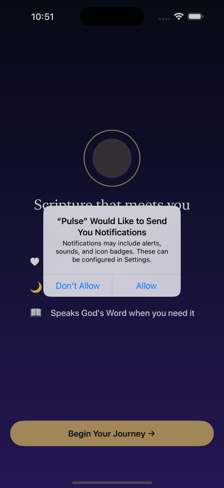
*Onboarding: Welcome step — app name, tagline, "Begin Your Journey" call to action.*

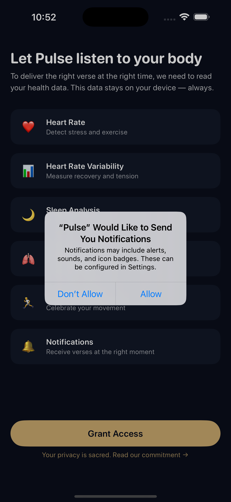
*Onboarding: HealthKit permission request — Heart Rate, HRV, Sleep Analysis, Activity, SpO2 listed.*

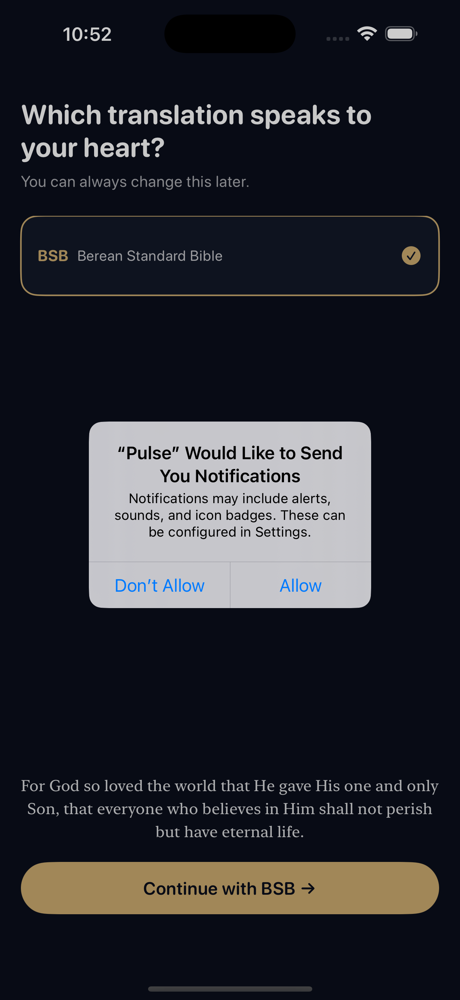
*Onboarding: Bible translation selection — BSB selected with John 3:16 preview. List is populated dynamically from `GET /v1/bibles` using the registered App Key.*

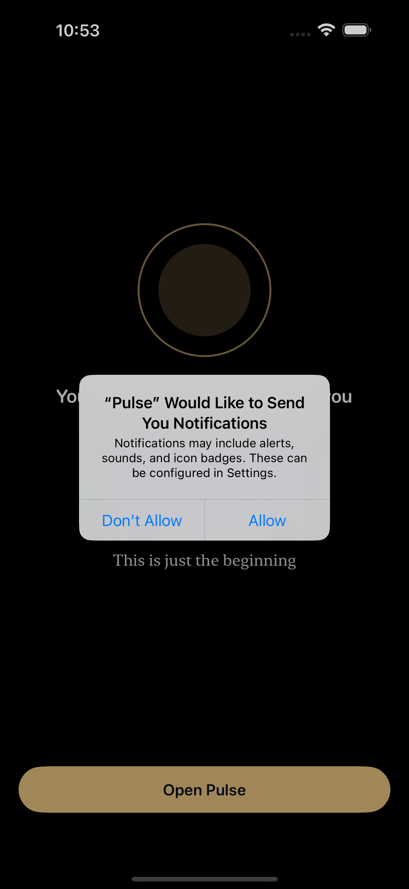
*Onboarding: Completion screen with "Open Pulse" CTA.*

### iPhone HomeView

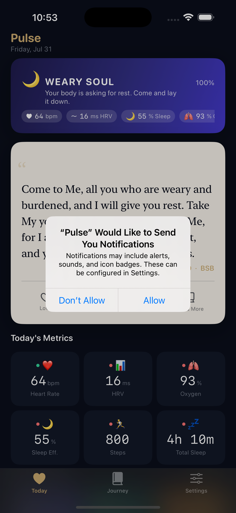
*HomeView: "Weary Soul" state (exhausted_depleted). Matthew 11:28 selected live by Gloo AI Studio and fetched from YouVersion (BSB). Metrics grid shows HR 64 bpm, HRV 16 ms, Oxygen 93%, Sleep Eff. 55%, Steps 800.*

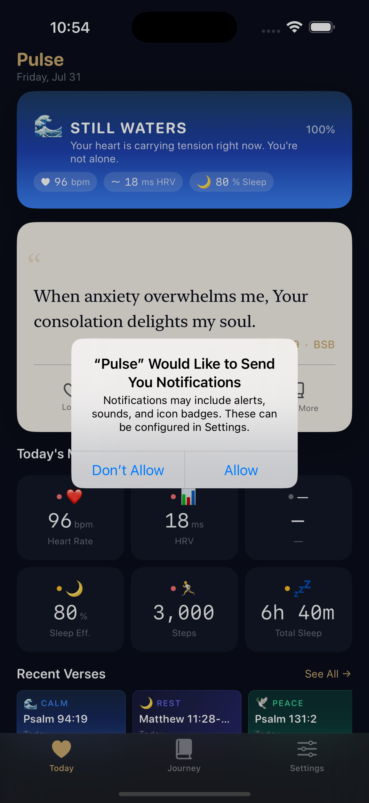
*HomeView: "Still Waters" state (stressed_anxious). Psalm 94:19, live API delivery.*

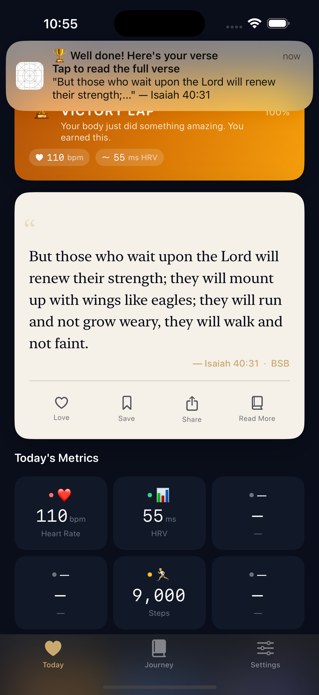
*HomeView: "Victory Lap" state (energized_post_workout). Isaiah 40:31. Foreground notification banner visible.*

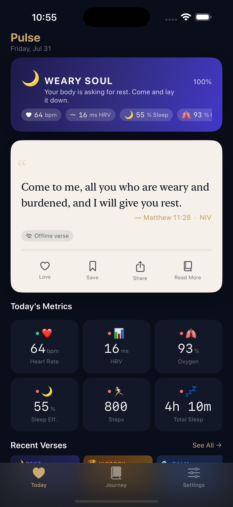
*HomeView: Offline mode. "Offline verse" badge on card; Matthew 11:28 served from SwiftData cache. No crash, no empty screen.*

### History and Share

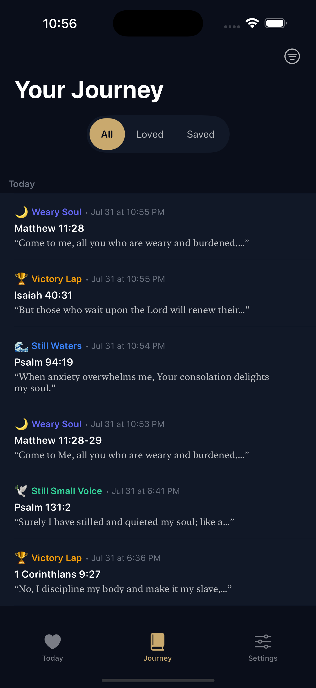
*HistoryView: Date-sectioned verse journey. All / Loved / Saved filter tabs.*

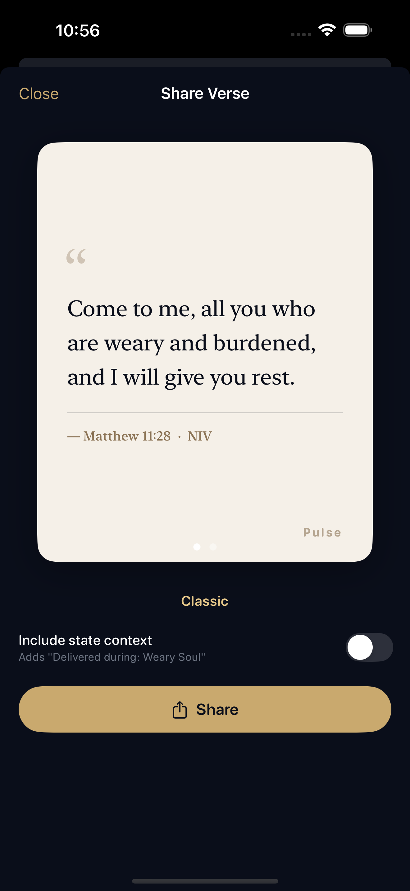
*Share card: Classic cream variant. Exportable as PNG via ImageRenderer + UIActivityViewController.*

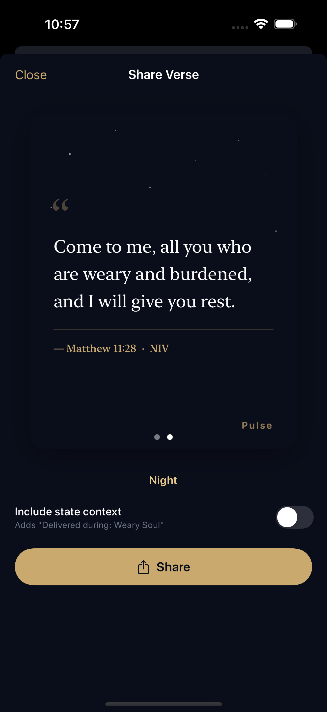
*Share card: Night starfield variant with gold text.*

### Settings

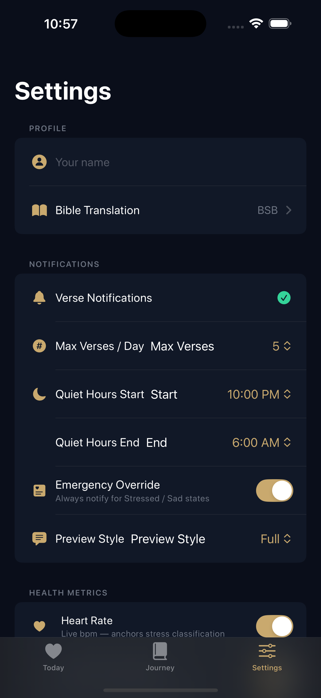
*SettingsView: Translation (BSB), notification preferences, quiet hours, health metrics, and "Clear History" (data deletion).*

### Notifications

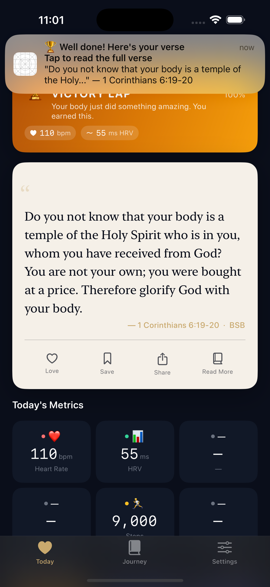
*Foreground notification: "Well done! Here's your verse" with 1 Corinthians 6:19-20 — Victory Lap state.*

### Apple Watch


*Apple Watch VerseView: Matthew 11:28 (full text), Love / Save / Share action buttons.*

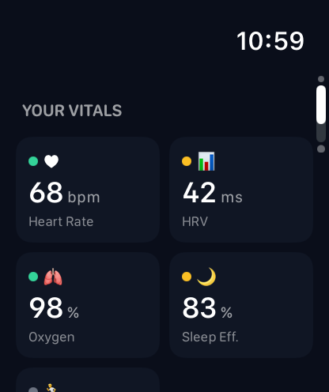
*Apple Watch VitalsView: HR 68, HRV 42, SpO2 98%, Sleep 83% — live metrics grid.*


*Apple Watch HistoryView: Recent section — Weary Soul, Victory Lap, Still Waters in reverse-chronological order.*

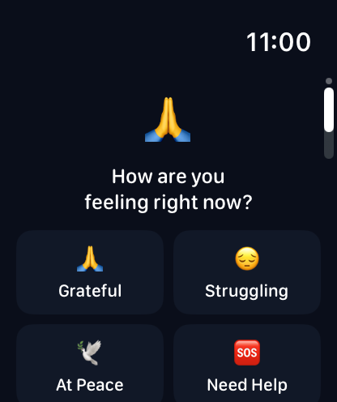
*Apple Watch PrayerView: Grateful / Struggling / At Peace / Need Help — prayer state buttons that relay reaction back to iPhone.*

---

## Future Roadmap (Phase 2)

The following features were scoped as Phase 2 from the start of the project. They are not missing — they are deliberately deferred.

**Live Activities.** An always-visible Dynamic Island / Lock Screen widget showing the current verse reference and state name, updated when a new verse is delivered.

**Breath prayer with haptic rhythm.** A guided breathing exercise on the watch, haptic-paced to a calming rhythm, with a selected verse as the meditation anchor.

**Streak tracking.** Daily engagement tracking — consecutive days with a delivered verse, shown as a sparkline in the History view and a complication data source.

**7-day sparklines.** A miniature chart of HRV or sleep quality trends in the HomeView metrics grid, giving the user a week-at-a-glance biometric context.

**Remaining share card variants.** Two additional card design variants beyond Classic and Night: a Scripture Highlight card (single word or phrase emphasized) and a Minimal card (verse text only, no branding).

**Complication polish.** Extra watchOS complication families and richer data display (e.g., state color gradient on the circular complication).

**Onboarding particle effect.** An animated verse particle effect on the welcome screen (scoped out of Phase 1 to hit the submission deadline).

**Verse of the Day bonus delivery.** An optional morning delivery using the YouVersion VOTD endpoint (`GET /v1/verse_of_the_days/{day}`) as a supplement to the biometric-triggered delivery.

**Localization.** `Localizable.strings` extraction for all user-facing text; the app currently uses hardcoded English strings throughout.

**App icon and image assets.** Production-quality app icon (ECG line transitioning to a cross), launch screen, and App Store screenshots.

**App Store release.** Privacy Policy, Terms of Service, YouVersion API commercial licensing, and Apple App Review submission if the competition submission advances.
